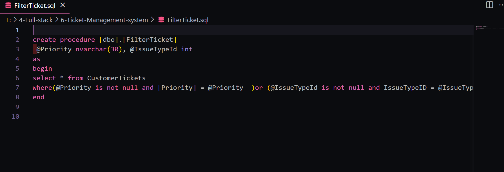
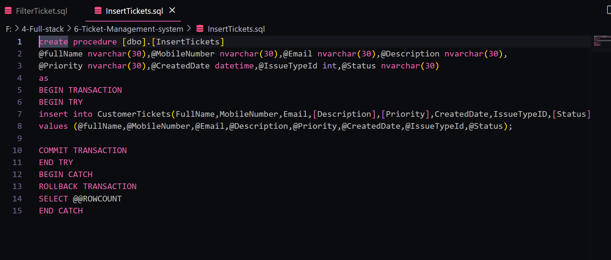
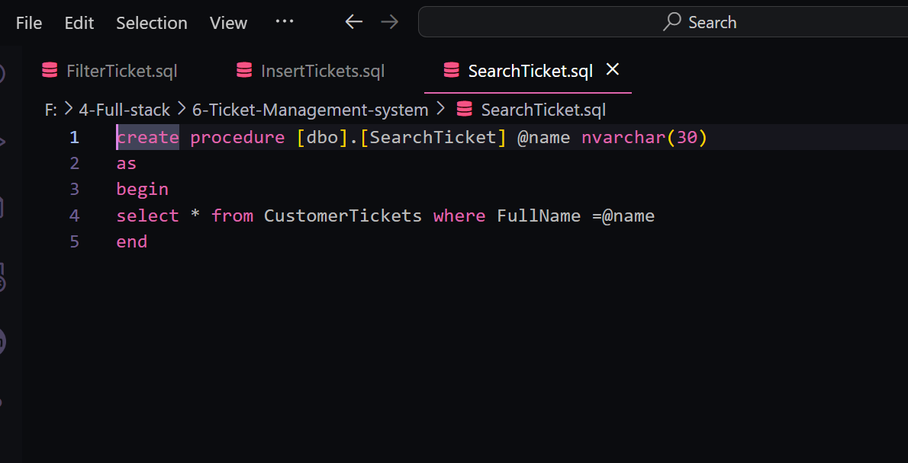
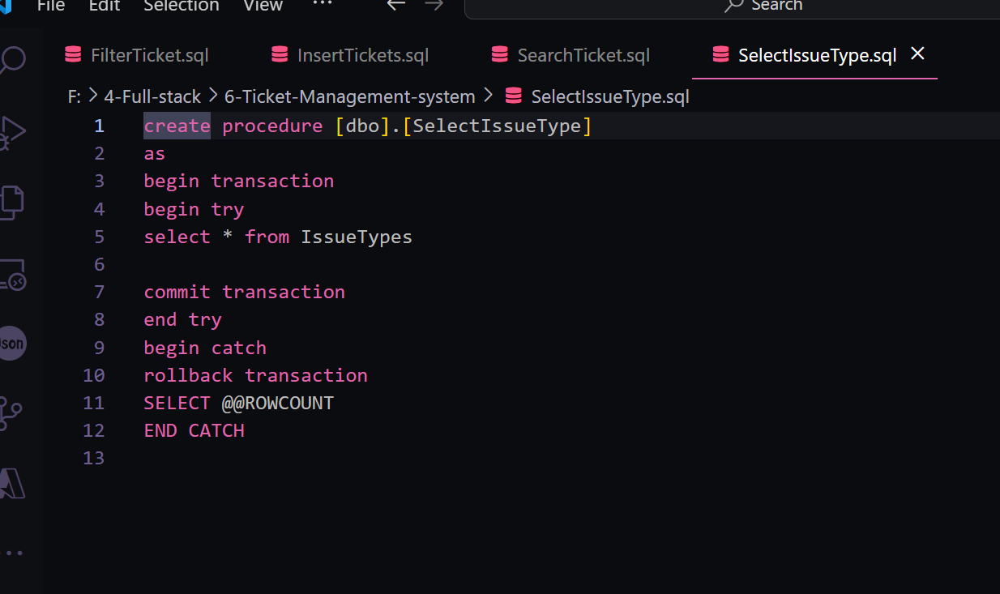
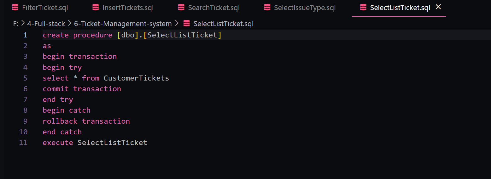
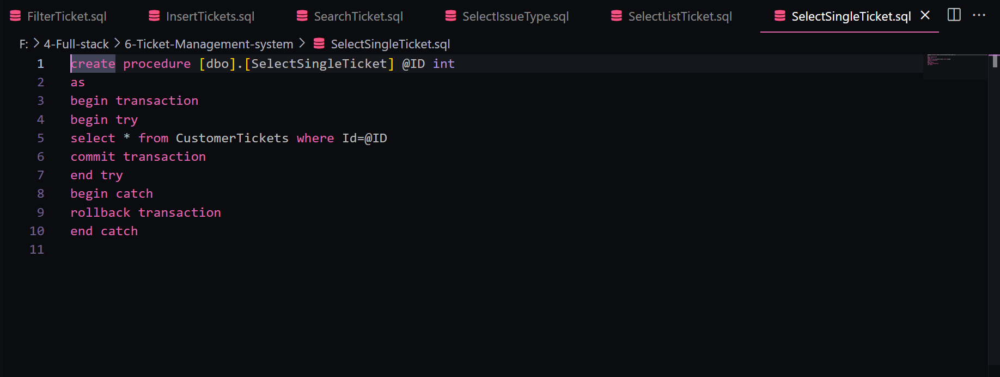
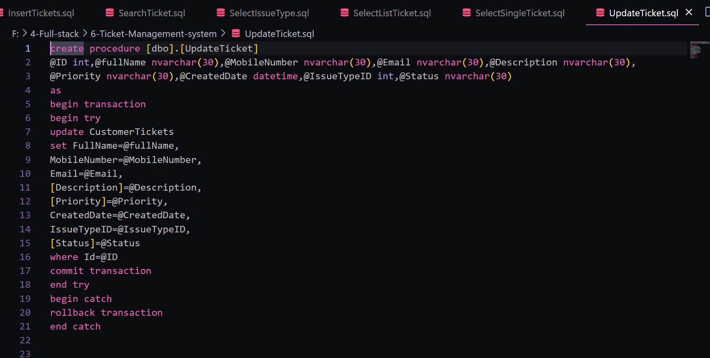

  <h1>Ticket Management System 🎫</h1>
  
A lightweight and efficient system for managing tickets using ASP.NET 5 , SQL Server, Stored Procedures, and FluentValidation — built following Clean Architecture principles.

  
  
  
  

---

## 📚 Table of Contents

- [Features](#features)
- [Tech Stack](#tech-stack)
- [Database Diagram](#database-diagram)
- [Getting Started](#getting-started)
- [Validation](#validation)
- [Contributing](#contributing)

---

## 🚀 Features

- 📋 Create, update, filter, and manage support tickets
- 🧪 FluentValidation for input validation (separated from DTOs)
- 🔎 Filtering and searching through ticket data
- 📆 ReadOnly fields for name and creation date
- 🔄 Stored Procedures for optimized DB performance
- ✅ Backend & Frontend validation

---

## 🧰 Tech Stack

- ASP.NET 5
- Entity Framework Core
- SQL Server (with Stored Procedures)
- FluentValidation

---

## 🗃️ Database Diagram

